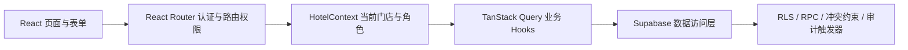

# The Wild Oasis

一个基于 React 与 Supabase 构建的连锁酒店运营管理系统，面向酒店管理者、店长、前台和财务等角色，提供多门店切换、客房管理、预订流转、房态排期、经营分析、员工权限及操作审计等能力。

## 项目简介

系统以“当前门店”为业务上下文。用户登录后，只能查看自己被授权的门店；切换门店时，客房、预订、报表和审计日志会同步切换。前端通过路由、菜单和操作按钮控制交互权限，Supabase Row Level Security（RLS）负责数据库层的数据隔离和最终授权。



## 核心功能

- **多门店协同：** 用户可在被授权的门店之间切换，业务请求和查询缓存均按门店隔离。
- **多角色权限：** 提供 Owner、Manager、Front Desk 和 Finance 四类门店角色，并控制页面、菜单和业务操作。
- **客房管理：** 支持客房新增、编辑、复制、删除和图片上传。
- **预订管理：** 支持创建预订、查看详情、改期、删除、办理入住和退房。
- **预订冲突检测：** 通过 PostgreSQL 日期区间约束避免同一客房在同一时间被重复预订。
- **房态排期：** 以日历形式展示客房的预订和维修状态，支持拖拽调整预订日期及维修封房。
- **经营分析：** 展示预订量、营收、入住率、入住时长分布和销售趋势，并支持条件筛选与 CSV 导出。
- **操作审计：** 自动记录关键数据的新增、修改和删除行为，包括操作者、操作时间及变更前后内容。
- **用户体验：** 支持深色/浅色主题、响应式登录页、路由懒加载、错误边界和消息提示。

## 角色权限

角色权限与具体门店绑定。同一用户可以加入多个门店，也可以在不同门店拥有不同角色。

| 角色 | 主要权限 |
| --- | --- |
| Owner | 当前已授权门店的全部功能，包括员工与角色管理 |
| Manager | 管理预订、客房、设置和维修排期，但不能管理员工角色 |
| Front Desk | 查看及创建预订、改期、办理入住退房、查看客房与排期 |
| Finance | 查看预订、经营报表与审计日志，并导出报表 |

> 前端隐藏无权访问的路由和按钮是为了改善交互体验；Supabase RLS 才是数据安全的最终边界。

## 技术栈

- **前端框架：** React 18、React Router 6、Vite
- **服务端状态：** TanStack Query（React Query）
- **表单管理：** React Hook Form
- **样式方案：** Styled Components
- **数据可视化：** Recharts
- **后端服务：** Supabase Auth、PostgreSQL、Storage、RPC、RLS
- **日期处理：** date-fns
- **质量保障：** ESLint、Node.js Test Runner

## 在新电脑上克隆并运行

### 1. 安装必要软件

新电脑需要安装：

- [Git](https://git-scm.com/)
- [Node.js](https://nodejs.org/) 18 或更高版本（安装 Node.js 时会同时安装 npm）
- [Visual Studio Code](https://code.visualstudio.com/)

安装完成后，可以在终端检查：

```bash
git --version
node -v
npm -v
```

以上命令均能正常输出版本号后再继续。

### 2. 从 GitHub 克隆项目

打开 VS Code，在菜单中选择 **Terminal → New Terminal**，然后执行：

```bash
git clone https://github.com/elkbaby/the-wild-oasis.git
cd the-wild-oasis
```

如果是通过 VS Code 的 **Clone Git Repository** 功能克隆，只需在克隆完成后打开项目文件夹，再打开 VS Code 终端即可。

### 3. 安装项目依赖

在项目根目录，也就是存在 `package.json` 的目录中执行：

```bash
npm install
```

仓库中包含 `package-lock.json`。如果希望严格按照锁定版本安装，也可以使用：

```bash
npm ci
```

两条安装命令选择一条执行即可，不需要重复执行。

### 4. 启动开发环境

```bash
npm run dev
```

终端会显示本地访问地址，通常为：

```text
http://localhost:5173
```

按住 `Ctrl`（macOS 通常为 `Command`）点击终端中的地址，或者将地址复制到浏览器即可访问。

### 5. 登录系统

项目连接的是现有 Supabase 后端，因此可以继续使用该项目已有的登录账号。账号必须同时满足：

- 已存在于 Supabase Authentication；
- 已被分配到至少一家门店；
- 在对应门店拥有 Owner、Manager、Front Desk 或 Finance 角色。

如果页面无法获取数据，请先确认 Supabase 项目处于正常运行状态，没有因为长期未使用而暂停。

## Supabase 配置说明

### 使用当前项目已有的 Supabase

当前仓库**没有 `.env` 文件，也不要求新建 `.env`**。Supabase Project URL 和前端可用的 anon key 已配置在：

```text
src/services/supabase.js
```

因此，正常从 GitHub 克隆后只需安装依赖并执行 `npm run dev`，无需再次填写 Supabase 配置。

> `anon` key 用于浏览器客户端，不是数据库密码或 `service_role` 密钥。项目必须保持 RLS 开启；不要把数据库密码或 `service_role` 密钥写入前端代码。

### 连接自己的 Supabase 项目

如果需要改为自己的 Supabase 后端，需要：

1. 准备与当前项目兼容的基础表结构；
2. 按顺序执行 `supabase/migrations` 中的 SQL；
3. 配置 Storage Bucket 和对应 RLS；
4. 将 `src/services/supabase.js` 中的 Project URL 与 anon key 替换为新项目配置；
5. 在 Supabase Authentication 中创建用户，并为用户分配门店成员关系和角色。

详细迁移、备份、RLS、Storage 和验证步骤见 [SUPABASE_SETUP.md](./SUPABASE_SETUP.md)。不要通过关闭 RLS 来解决权限问题。

## 常用命令

```bash
# 启动开发服务器
npm run dev

# 运行代码检查
npm run lint

# 运行测试
npm test

# 构建生产版本
npm run build

# 本地预览生产构建
npm run preview
```

生产构建产物会生成在 `dist` 目录中。

## 项目目录

```text
the-wild-oasis/
├── public/                 # Logo 等公共静态资源
├── src/
│   ├── context/            # 当前门店、主题等全局状态
│   ├── data/               # 示例数据与初始化工具
│   ├── features/           # 按业务领域组织的功能模块
│   │   ├── authentication/ # 登录、注册和账号信息
│   │   ├── audit/          # 操作审计
│   │   ├── bookings/       # 预订管理
│   │   ├── cabins/         # 客房管理
│   │   ├── calendar/       # 房态排期与维修封房
│   │   ├── check-in-out/   # 入住和退房
│   │   ├── dashboard/      # 首页经营数据
│   │   ├── hotels/         # 门店切换与角色权限
│   │   ├── reports/        # 经营报表
│   │   ├── settings/       # 门店设置
│   │   └── users/          # 员工与角色管理
│   ├── hooks/              # 通用 Hooks
│   ├── pages/              # 路由页面
│   ├── services/           # Supabase 客户端和数据访问层
│   ├── styles/             # 全局样式与主题变量
│   ├── ui/                 # 通用 UI 与复合组件
│   └── utils/              # 工具函数
├── supabase/migrations/    # 数据库迁移、RPC、RLS 和 Storage 策略
├── tests/                  # 权限与迁移测试
├── SUPABASE_SETUP.md       # Supabase 配置与验证说明
├── package.json            # 依赖与脚本
└── vite.config.js          # Vite 构建配置
```

## 常见问题

### `npm` 命令不存在

说明 Node.js 尚未正确安装。重新安装 Node.js，关闭并重新打开 VS Code 后，再执行 `node -v` 和 `npm -v` 检查。

### `npm install` 失败

先确认当前终端位于项目根目录，并检查网络连接。然后可以删除未完整安装的 `node_modules` 后重新执行 `npm install`。

### 页面能打开但无法登录或没有数据

依次检查：

1. Supabase 项目是否处于运行状态；
2. 登录账号是否存在；
3. 用户是否已加入门店并分配角色；
4. 浏览器开发者工具 Network/Console 中是否存在 RLS 或网络错误。

### 端口 5173 被占用

Vite 会自动选择其他可用端口，请以终端实际显示的地址为准。

## 安全说明

- 不要在前端保存数据库密码或 Supabase `service_role` 密钥。
- 不要为了临时解决访问问题而关闭 RLS。
- 新增页面、菜单或按钮权限时，应同步检查数据库策略是否覆盖对应操作。
- 生产环境部署前应完成角色权限、跨门店隔离和预订冲突的回归验证。
